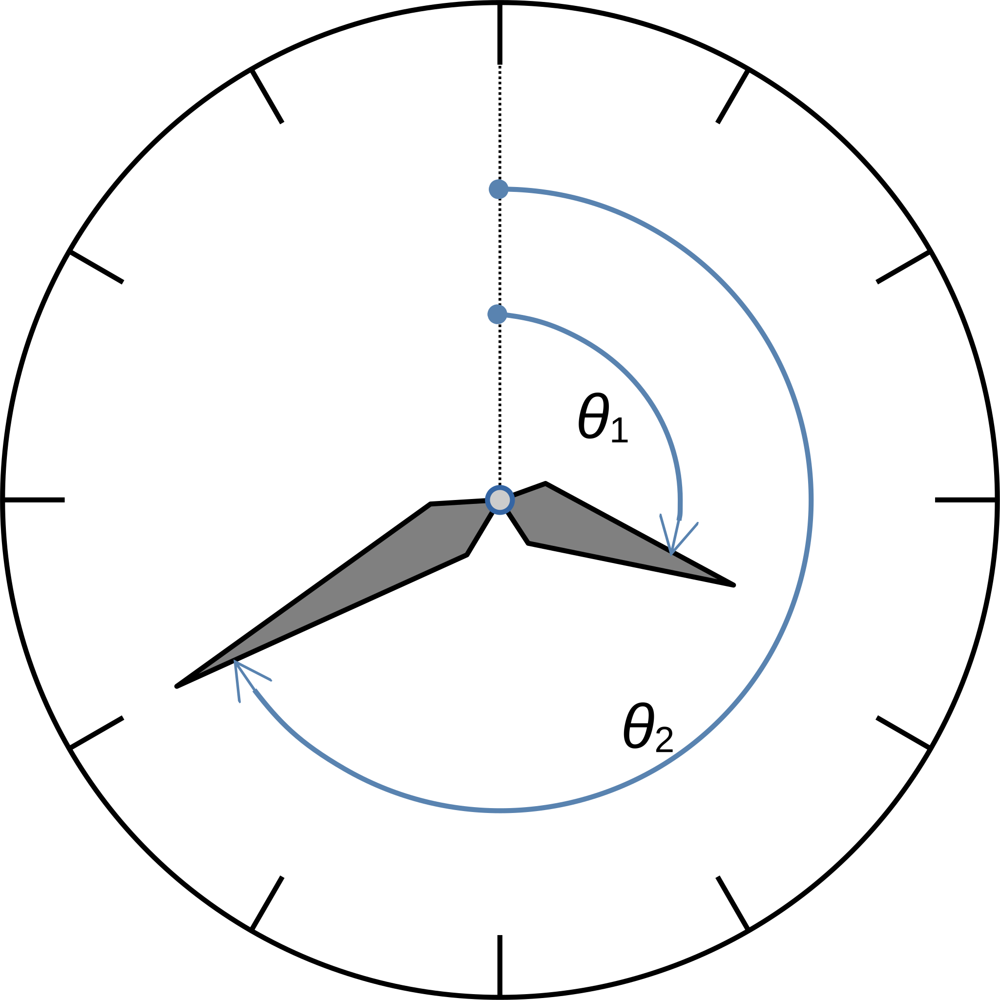



## Overview



In this problem, you will complete the implementation and tests of two methods to compute the angles to which the hands of a clock will be oriented at a given time of day.

For example, in the image below, the time is either 3:40 AM or 3:40 PM (in the second case, the hour value would be 15, rather than 3). The angle indicated by $\theta_1$ is the angle of the hour hand---that is, the angle in degrees measured clockwise from 12 o'clock to the hour hand; at 3:40 AM or 3:40 PM, that angle is 110&deg;. The angle indicated by $\theta_2$ is the angle of the minute hand; at 3:40 AM or 3:40 PM---in fact, at 40 minutes after _any_ hour---that angle is 240&deg;. Those two values---110 and 240---would be the values returned (separately) by the 2 methods you implement, when the hours value is 3 or 15 and the minutes value is 40.

{:#figure}
{:.half-width}

**Important**: In this problem, it is actually possible to complete the [stretch goal implementation](#stretch-goal) directly, without first completing the [basic implementation](#basic-problem): Completing the stretch goal correctly will also satisfy the requirements for the basic problem, and will earn those points as well. _However,_ there are a couple caveats:

1. We do not recommend pursuing this approach before you read the _full_ content of this page carefully, and are confident that you understand the use of the term [_normalization_](#normalization), in the context of the stretch goal.

2. Your test cases must include those given for the basic problem, as well as those for the stretch goal, to earn full credit on the unit testing portions of the problem. 

## Basic problem

### Implementation

#### Declaration

The `edu.cnm.deepdive.ClockAngles` class contains 2 methods which must be completed to compute the angles formed by the minute and hour hands (each measured clockwise from 12 o'clock) of a clock at a specified time of day. The table below shows the signature, return types, and intended functionality of these methods; both use the `public` and `static` modifiers.

| Return type | Signature |                                                                                                           Intended functionality                                                                                                           |
|:--:|:--:|:------------------------------------------------------------------------------------------------------------------------------------------------------------------------------------------------------------------------------------------:|
| `double` | `hourHandDegrees(int hours, double minutes)` | Computes and returns the angle made by the hour hand, measured in degrees clockwise from vertical (12:00), in the interval [0, 360)---that is, in the interval starting with (and including) 0, and ending with (but _not_ including) 360. |
| `double` | `minuteHandDegrees(double minutes)` |                                                   Computes and returns the angle made by the minute hand, measured in degrees clockwise from vertical (12:00), in the interval [0, 360).                                                   |

The implementation **must not** change the modifiers, return types, method names, or parameter types/number/order in either of these two methods.

For more method declaration details, see the [Javadoc documentation](api/edu/cnm/deepdive/ClockAngles.html#method.detail).

#### Specifications

1. For this basic task, you should assume that the value of the `hours` parameter will always be in $\lbrack 0 \mathrel{\ldotp\ldotp} 23 \rbrack$---that is, the integers from 0 to 23, inclusive.

2. For the basic task, assume that the value of the `minutes` parameter will always be in the real-valued interval $\left[ 0, 60 \right)$---that is a floating-point number ranging from 0 (inclusive) to 60 (exclusive).

3. An implication of the two points above is that your implementations is not required to test for values outside these ranges (e.g., to throw exceptions). Also, the method declarations do not include any `throws` clauses; your implementations _are not expected_ to throw any exceptions.

4. Assume a 12-hour clock face, even though `hours` may be greater than 12. For example, an `hours` parameter value of 14 is equivalent---in terms of the angle formed---to a value of 2.

5. The value that must be returned by each of the two methods **is not** the angle _between_ the two hands, but the angle formed from an imaginary vertical line segment extending upwards from the center of the clock face to the hand specified by the method name. If this is confusing, please review the [figure above](#figure), and note the boundaries of the arcs tracing out the angles $\theta_1$ and $\theta_2$. 

6. As indicated by the `minuteHandDegrees(double)` method signature, the angle of the minute hand doesn't depend at all on the value of the `hours` parameter, but only on the `minutes` value.

7. Assume that both clock hands are in continuous motion as time passes. Thus, the angle of the hour hand (returned by `hourHandDegrees(int, double)`) depends on the values of both `hours` and `minutes`, since the hour hand on the clock face advances even as the minutes advance.

8. The values returned by both methods must be within $\frac{1}{3600}$ of a degree (a quantity referred to as one second of arc) of the correct value. 

#### Tips

1. Please do not fall down the rabbit hole of assuming that the two methods must work together in coordination to produce a result. Each of the two methods has a distinct responsibility, and must be able to fulfill that responsibility independently of the other, without any assumptions about whether the other is invoked before or after it (or at all).

2. This task can be completed without the use of any trigonometric methods (e.g. `Math.sin`, `Math.cos`). Instead, focus on four simple facts: 

    1. There are 60 minutes per hour.

    2. 1 revolution around a circle sweeps through an angle of 360&deg;.
   
    3. The minute hand makes 1 revolution per hour. 
      
    4. The hour hand makes 1 revolution every 12 hours.  
  
3. Both of your methods have a return type of `double`, so you should beware of incorrectly (or unnecessarily) rounding floating-point expressions to integer values (e.g., through casting or `Math.round(double)`), or computing truncated integer values where floating-point values are needed (e.g., through integer division). 

4. You may find it useful---even if not strictly necessary---to create one or more additional `private static` methods as “helpers”.

5. Don't hesitate to declare any `private static` fields (esp. `private static final` constants) that you feel might simplify or clarify your code.

6. The methods to be completed include `TODO` comments to that effect.

### Unit tests

For unit testing credit, use JUnit5 to verify your code with the inputs and expected outputs below.

#### Test cases

The table below includes test cases for both `hourHandDegrees` and `minuteHandDegrees`. _This does not mean that your code should test both from a single test method._ Instead, notice that the first three columns contain test data for `hourHandDegrees`, while the second and fourth columns contain test data for `minuteHandDegrees`. 

| `hours` | `minutes` | Expected return value of `hourHandDegrees( hours, minutes)` | Expected return value of `minuteHandDegrees( minutes)` |
|:-------:|:---------:|:----------------------------------:|:-----------------------------:|
| `0` | `0` | `0` | `0` |
| `3` | `15` | `97.5` | `90` |
| `12` | `30` | `15` | `180` |
| `19` | `42` | `231` | `252` |
| `21` | `27.5` | `283.75` | `165` |
| `23` | `0.01` | `330.005` | `0.06` |
 
In evaluating your implementation, we reserve the right to include additional test cases; code that satisfies the specifications stated above should pass all such additional tests.

#### Additional specifications

1. Since actual return values must match expected values within $\frac{1}{3600}$ of a degree, the same value should be used as a testing tolerance.

#### Tips

1. The methods to be completed are `static`, and `ClockAngles` is `abstract`; do not attempt to create an instance of `ClockAngles`.

2. Some overloads of the JUnit5 `assertEquals` method for comparing floating-point values permit the specification of a tolerance (called `delta` in the Junit5 Javadocs). Only if the absolute difference between the expected and absolute values is greater than this tolerance does the assertion fail. For more information, see the [`org.junit.jupiter.api.Assertions` Javadocs](https://junit.org/junit5/docs/current/api/org.junit.jupiter.api/org/junit/jupiter/api/Assertions.html).

## Stretch goal

### Implementation

For the stretch goal, you must modify your previous implementations to normalize the values of the `hours` and `minutes` parameter values. That is, you must no longer make the assumptions described in the first two points of the [specifications (above)](#specifications), and properly handle values outside those ranges, as described below.

#### Specifications

1. With the change described above, _we must no longer assume_ that the `hours` parameter will always be in the integer interval $\lbrack 0 \mathrel{\ldotp\ldotp} 23 \rbrack$, or that the `minutes` parameter will always be in the real interval $\left[ 0, 60 \right)$. However, your implementation **must not** throw an exceptions if either of the values is outside the relevant range.

2. {:#normalization} Instead of testing for values outside the ranges and conditionally throwing exceptions, your code **must** accept and handle such values by _normalizing_ them.

    In general, _normalization_ refers to the process of transforming data values as preparation for analysis or other use. Such transformation might include adjusting them to a standardized scale, rounding them to a desired precision, etc.

    In this context, normalization requires us to recognize that our measurement of time is periodic in nature: just as the hours and minutes repeat as they advance (and also as we look backwards in time), the angles formed by the hands repeat.

    For example:

    1. A `minutes` value of 80 must be treated as 1:20 (1 hour, 20 minutes), with the hour being added to the `hours` value (if appropriate). Thus, an invocation of `minuteHandDegrees(80)` must return a value equal to that returned by `minuteHandDegrees(20)`; after all, the angle formed by 12 o'clock and the minute hand at 20 minutes past some hour is exactly the same as angle formed at 80 minutes past the same (or another) hour. 
    
        Continuing the example, an invocation of `hourHandDegrees(2, 80)` must return a value equal to `hourHandDegrees(3, 20)`, since 80 minutes after 2 o'clock is equivalent to 20 minutes after 3 o'clock.
    
    2. Similarly, a value of -15 for `minutes` would be treated as -1 hour (i.e. subtracting 1 from `hours`), plus 45 minutes. So, an invocation of `minuteHandDegrees(-15)` must return the same result as `minuteHandDegrees(45)`, while an invocation of `hourHandDegrees(15, -15)` must return a value equal to `hourHandDegrees(14, 45)`---i.e., 15 minutes before 15:00 (3 PM) is equivalent to 45 minutes after 14:00 (2 PM).

    3. Even in the basic problem, you already had to do some normalization on the `hours` value, by translating values in $\lbrack 12 \mathrel{\ldotp\ldotp} 23 \rbrack$ into the $\lbrack 0 \mathrel{\ldotp\ldotp} 11 \rbrack$ interval.

        Taking that a step further for the stretch goal, an `hours` value of -5 is equivalent to a value of 7, in terms of the angle formed by the hour hand; or, looking at it another way, 5 hours before midnight is 7 PM. On the other hand, an `hours` value of 37 is equivalent to a value of 1; that is, 37 hours after midnight is 1 PM, a day and a half later.
   
    4. With a seemingly complex case like `hourHandDegrees(-29, 131)`, we would first recognize that 131 minutes is also 2 hours, 11 minutes; so, we should get the same answer from `hourHandDegrees(-27, 11)`. But 27 hours before midnight of a given day is just 3 hours before midnight of the day before---which is also 21 hours _after_ the previous midnight. Thus, our original invocation should give the same result as `hourHandDegrees(21, 11)`---and, for that matter, the same result as `hourHandDegrees(9, 11)`.

In addition to the items immediately above (specific to the stretch goal), items 4--8 in the [basic problem specifications](#specifications) also apply to the stretch goal. 

#### Tips

### Unit tests

For unit testing credit on the stretch goal, use JUnit5 to verify your code with the inputs and expected outputs below.

#### Test cases

| `hours` | `minutes` | Expected return value of `hourHandDegrees( hours, minutes)` | Expected return value of `minuteHandDegrees( minutes)` |
|:-------:|:---------:|:----------------------------------:|:-----------------------------:|
| `34` | `120` | `0` | `0` |
| `-10` | `75` | `97.5` | `90` |
| `13` | `-30` | `15` | `180` |
| `-6` | `102` | `231` | `252` |
| `34` | `-32.5` | `283.75` | `165` |
| `-3` | `-93.03` | `223.485` | `161.82` |

In evaluating your implementation, we reserve the right to include additional test cases; code that satisfies the requirements stated above should pass all such additional tests.

#### Additional specifications

1. Again, since actual return values must match expected values within $\frac{1}{3600}$ of a degree, that value should be used as a testing tolerance.
